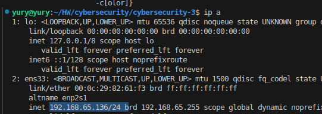
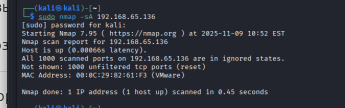
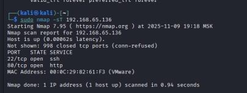
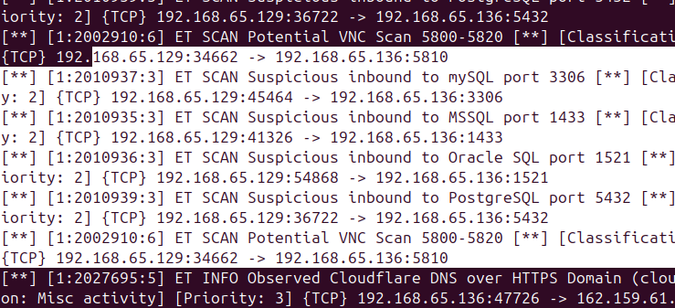
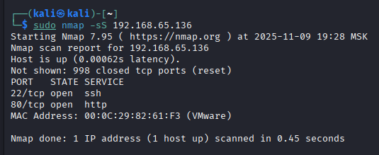
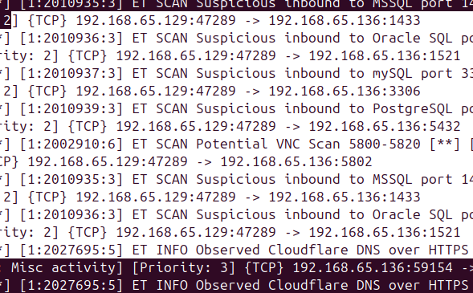
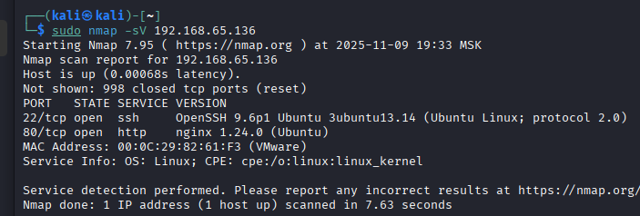
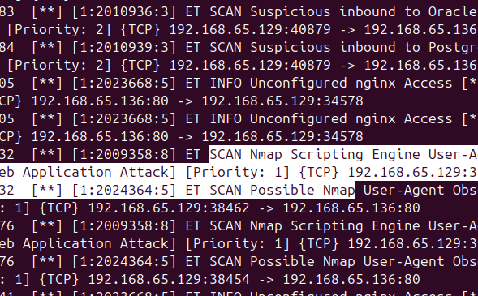

# Домашнее задание к занятию «Защита сети». Шелухин Юрий

### Подготовка к выполнению заданий

1. Подготовка защищаемой системы:
- установите **Suricata**,
- установите **Fail2Ban**.
2. Подготовка системы злоумышленника: установите **nmap** и **thc-hydra** либо скачайте и установите **Kali linux**. Обе системы должны находится в одной подсети.

---

**Подготовка**

Подготовим атакуемый хост (Ubuntu).   
Установим `Suricata`.  
`sudo add-apt-repository ppa:oisf/suricata-stable`
`sudo apt install suricata`  
`sudo suricata-update enable-source oisf/trafficid`  
`sudo suricata-update enable-source et/open`  
`sudo suricata-update update-sources`  
`sudo suricata -c /etc/suricata/suricata.yaml -T`  
`sudo systemctl start suricata`  

Выясним ip атакуемого хоста.  
`ip a`  

    

Изменим конфигурационный файл `/etc/suricata/suricata.yaml`.  
`af-packet:`  
  `- interface: ens33`  
    `cluster-id: 99`  
    `cluster-type: cluster_flow`  
    `defrag: yes`  
    `use-mmap: yes`  
    `tpacket-v3: yes`  

 `EXTERNAL_NET: "any"`  

`rule-files:`  
  `- suricata.rules`  
  `- scan.rules`  
  `- emerging-scan.rules`  
  `- emerging-info.rules`  
  `- compromised.rules`  

Откроем логи.  
`sudo tail /var/log/suricata/suricata.log`  
`sudo tail /var/log/suricata/stats.log`  
`sudo tail -f /var/log/suricata/fast.log`  

Установим `Fail2Ban` и откроем его логи.  
`sudo apt install fail2ban`  
`systemctl enable fail2ban`  
`systemctl start fail2ban`  
`sudo tail -f /var/log/fail2ban.log`  

---

### Задание 1

Проведите разведку системы и определите, какие сетевые службы запущены на защищаемой системе:  
**sudo nmap -sA < ip-адрес >**  
**sudo nmap -sT < ip-адрес >**  
**sudo nmap -sS < ip-адрес >**  
**sudo nmap -sV < ip-адрес >**  
По желанию можете поэкспериментировать с опциями: https://nmap.org/man/ru/man-briefoptions.html.  
*В качестве ответа пришлите события, которые попали в логи Suricata и Fail2Ban, прокомментируйте результат.*  

**Решение**

Проведем разведку.  
`sudo nmap -sA 192.168.65.136`  
Результат сканирования показывает, что ACK-сканирование не обнаружило фильтруемых портов на вашем хосте 192.168.65.136. Все 1000 портов отвечают RST-пакетами. Нет фильтрации на этих портах (межсетевой экран пропускает трафик). Порты в состоянии unfiltered - они доступны для сканирования.    
Согласно логам Surikata для данных настроек сканирование не выявлено.

 

`sudo nmap -sT 192.168.65.136`  
Это TCP Connect-сканирование (-sT) выявило открытые порты и службы на атакуемом хосте.  
PORT   STATE SERVICE  
22/tcp open  ssh  
80/tcp open  http  
Surikata выявила сканирование.  

 
 

`sudo nmap -sS 192.168.65.136`  
SYN-сканирование показало схожие результаты.  
Surikata также выявила сканирование.

   
   

`sudo nmap -sV 192.168.65.136`  
Version-сканирование показало детальную информацию о сервисах.  
Порт	   Сервис	         Версия	        Детали  
22/tcp	   SSH	             OpenSSH 9.6p1	Ubuntu 3ubuntu13.14  
80/tcp	   HTTP	             nginx 1.24.0	Ubuntu  
Suricata обнаружила Nmap version-сканирование.

 
 

Fail2ban по умолчанию не предназначен для обнаружения сканирования портов утилитой Nmap. Его основная задача — защита от атак подбора паролей путем анализа логов аутентификации. В текущей настройке (из коробки) сканирование Nmap хоста с помощью fai2ban выявлено не было. 

---

### Задание 2

Проведите атаку на подбор пароля для службы SSH:

**hydra -L users.txt -P pass.txt < ip-адрес > ssh**

1. Настройка **hydra**: 
 
 - создайте два файла: **users.txt** и **pass.txt**;
 - в каждой строчке первого файла должны быть имена пользователей, второго — пароли. В нашем случае это могут быть случайные строки, но ради эксперимента можете добавить имя и пароль существующего пользователя.

Дополнительная информация по **hydra**: https://kali.tools/?p=1847.

2. Включение защиты SSH для Fail2Ban:

-  открыть файл /etc/fail2ban/jail.conf,
-  найти секцию **ssh**,
-  установить **enabled**  в **true**.

Дополнительная информация по **Fail2Ban**:https://putty.org.ru/articles/fail2ban-ssh.html.
*В качестве ответа пришлите события, которые попали в логи Suricata и Fail2Ban, прокомментируйте результат.*

---